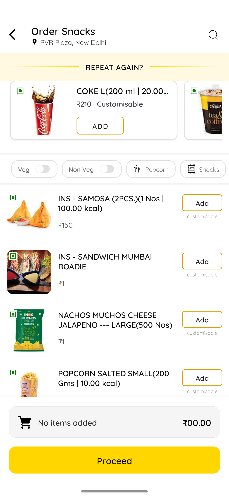
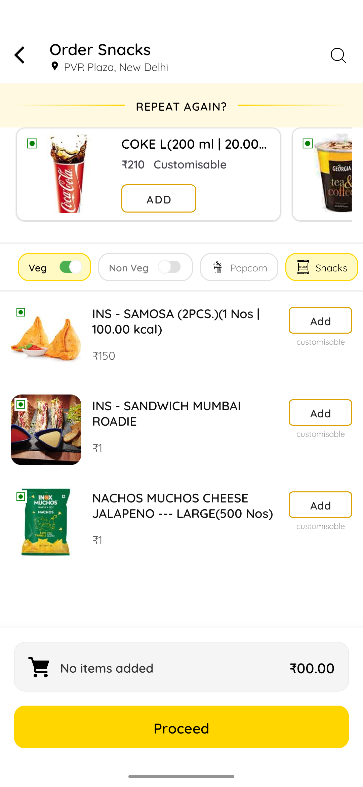
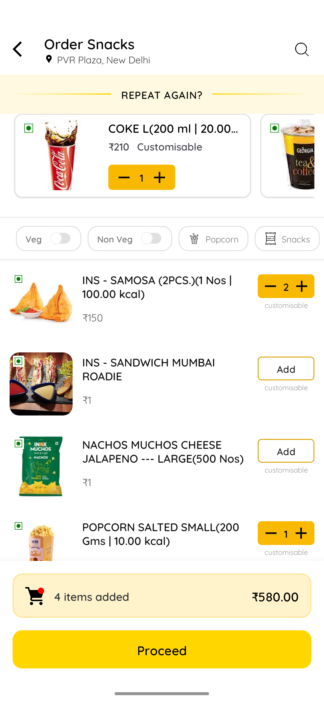
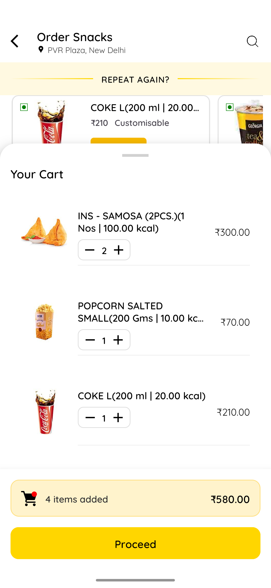

# 🍔 Food & Beverage Ordering Module
---
## 📸 Screenshots

| Screen | Screen2 | Screen3 | Screen4 |
| :---: | :---: | :---: | :---: |
|  |  |  |  |

---

## ✨ Features

* **Fixed Toolbar with Location:** Custom MaterialToolbar featuring subtitle location and search actions.
* **Sticky Filter Chips:** Category-based filtering (Veg, Non-Veg, Snacks) that sticks to the top during scroll.
* **Horizontal "Repeat Again":** A dedicated section for quick re-ordering with custom gradient-line headers.
* **Inline Bottom Sheet:** A `BottomSheetBehavior` driven cart that slides up over the main list without hiding the action button.
* **Reactive State Management:** Powered by `StateFlow` and `Shared ViewModel` for instant UI updates across all components.
* **Material 3 Design:** Full support for Material 3 components, including `ShapeableImageView` and `MaterialCardView`.

---

## 🛠 Tech Stack

* **Language:** Kotlin
* **Architecture:** MVVM (Model-View-ViewModel) + Clean Architecture
* **DI:** Dagger Hilt
* **UI Components:** * CoordinatorLayout & AppBarLayout
    * BottomSheetBehavior
    * RecyclerView (Horizontal + Vertical)
* **Image Loading:** Coil (handles Base64 strings)
* **Reactive Logic:** Kotlin Coroutines & Flow

---

## 📂 Project Structure

```text
app/
├── src/main/java/com/ayush/inoxassig/
│   ├── data/           # Repository and Data Sources
│   ├── di/             # Hilt Modules
│   ├── model/          # Data Classes (FoodItem, FilterItem)
│   ├── ui/
│   │   ├── main/       # MainActivity & ViewModels
│   │   └── adapters/   # RecyclerView Adapters
│   └── utils/          # Extension functions & Constants
└── src/main/res/
    ├── layout/         # XML UI layouts
    ├── drawable/       # Custom shapes and gradients
    └── values/         # Themes and Styles
